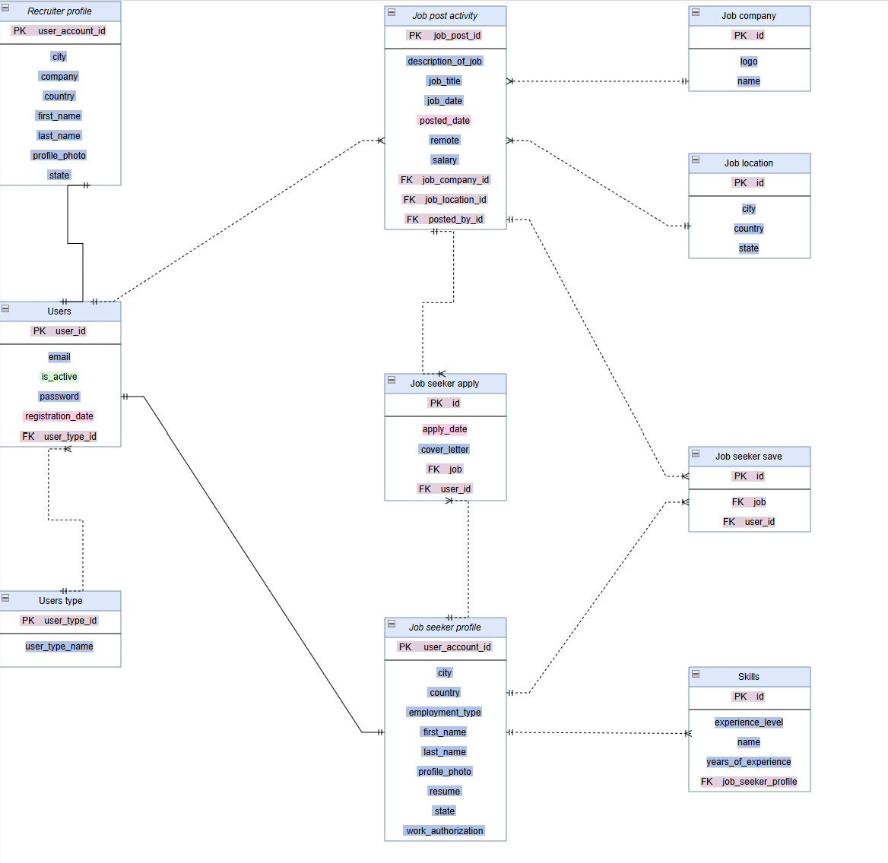

# WORKLY

- Common requirements
    - Register for a new account
    - Login/Logout

- Requirements - Recruiter
    - Post a new job
    - View our jobs
    - View list of candidates that have applied for a job
    - Edit profile and upload profile photo 

- Requirements - Candidate
    - Search for jobs
    - Apply for a job
    - View list of jobs that the candidate has applied for
    - Edit profile and upload profile photo
    - Upload CV

- Relations between entities:
    - Recruiter profile : Users => 1:1 (a recruiter profile is associated with one user)
    - Users type : Users => 1:M (an UserType can have many users; many users can have one UserType)
    - Users : Job post activity => 1:M
    - Users : Job seeker profile => 1:1 (a job seeker profile is associated with one user)
    - Job seeker profile : Job seeker apply => 1:M (a job seeker profile can apply to multiple jobs)
    - Job seeker profile : Job seeker save => 1:M (a job seeker profile can have many items saved)
    - Job seeker profile : Skills => 1:M (a job seeker can have one or many skills)
    - Job post activity : Job seeker apply => 1:M (a job post activity can have multiple people who've applied to it)
    - Job post activity : Job seeker save => 1:M (a job post activity can have many candidates saved)
    - Job post activity : Job location => M:1
    - Job post activity : Job company => M:1
    

- Database entities:
    - Users: basic information about an user
    - UsersType: an user role